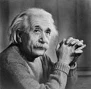
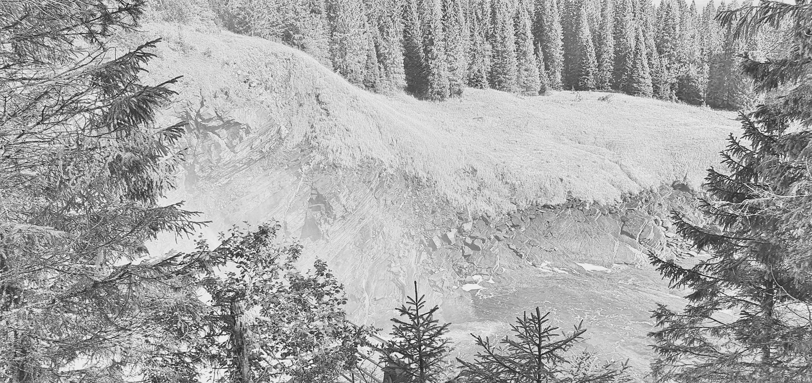

## Histogram normalization and bin selection, with example application to image equalization

Back to [github material_on_nth_element/README.md](../../README.md)

Or to proposal at https://github.com/jmlundberg/p2375

### Image and data equalization

Image equalization, or data equalization in general is a data processing technique used to enhanced contrast.

The subject described for example at https://en.wikipedia.org/wiki/Histogram_equalization and https://www.tutorialspoint.com/dip/histogram_equalization.htm

Equalization makes use of the
[Cumulative distribution function, CDF](https://en.wikipedia.org/wiki/Cumulative_distribution_function)(wikipedia) of the image (or data in general).
The cumulative distribution can be estimated by taking the cumulant of a *histogram* of the data. The result is thus a function of the selected binning in relation to the distribution of the data. Finding good bins is itself done by histogram normalization, which itself relies on an estimated CDF.

### Sort and partition (nth_element) based image normalization

An interesting alternative to cumulant-of-histrogram, is to calculate or estimate the CDF from the ordered data directly. If this is done with a full sort, and exact descriptive CDF is obtained, resulting in a loss-less equalization (modulo floating point and image format aspects).

As a performance optimization we can avoid a full sort, and instead use multi-nth `partition`, aka `nth_element` of [p2375](https://github.com/jmlundberg/p2375)
to ensure exact results at specific cumulant values (partition points) in the CDF, such as at 0.25, 0.5, 0.75.
That is, we use a range-of-nth partitioning to approximate the full sorted data (here using linear interpolation for simplicity).

#### Applied example - Einstein

Example image: Einstein. Original (left), equalized using sort-based CDF (right)

 

Again, the original (left), compared to equalization using approximate CDF using **range-of-nths** partitioning with `m=7`, `m=5`, or `m=3` partition points.

   

The exact CDF (using sort) is shown in gray, along with the `range-of-nths` approximations.

 .

#### Applied example - "Tennforsen"

Example image: Tennforsen (Sweden). Original (left), equalized using sort-based CDF (right)

original, vs sort based:

 

Again, the original (left), compared to equalization using approximate CDF using **range-of-nths** partitioning with `m=5`, `m=3`, or `m=3` partition points:

original, vs `m=5`:

`m=3`, vs `m=2`:

 

The exact CDF (using sort) is shown in gray, along with the `range-of-nths` approximations.

 .

#### Summary and notes

Examples of use of `range-of-nths` algorithm [p2375](https://github.com/jmlundberg/p2375) (aka `numpy.partition`) for image / histogram equalization. Performance of `range-of-nths` vs sort
is discussed at [../../PERFORMANCE.md](../../PERFORMANCE.md)

For reference, a more detailed description of sort-based image equalization: [
Image enhancement using sorted histogram specification and POCS postprocessing -
Il-Lyong Jung and Chang-Su Kim, 2007 IEEE](https://projet.liris.cnrs.fr/imagine/pub/proceedings/ICIP-2007/pdfs/0100545.pdf)
